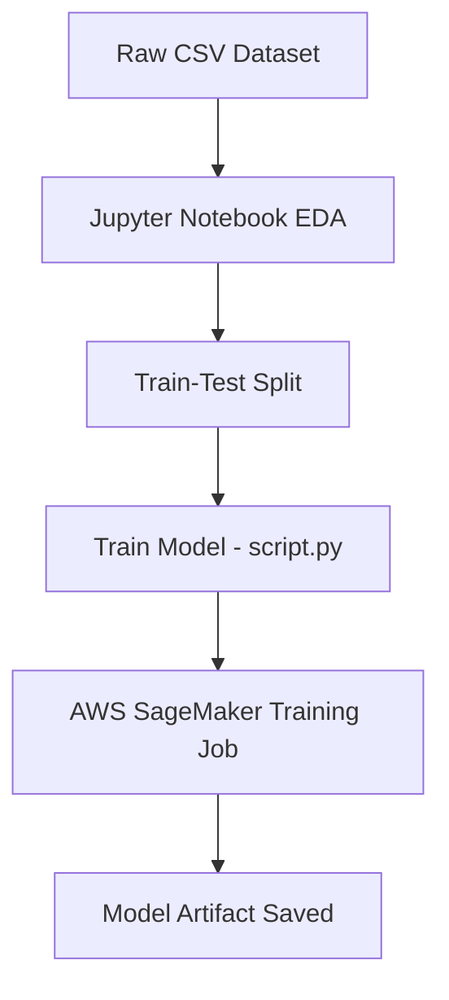

# 📊 Mobile Price Classification using AWS SageMaker  
This project demonstrates building and deploying a machine learning model to predict mobile phone price ranges using AWS SageMaker. It includes data preprocessing, training, and evaluation steps in a scalable cloud environment.  
## 📁 Project Structure  
AwsSagemaker/  
├── .gitignore  
├── mob_price_classification_train.csv     # Raw training dataset  
├── train-V-1.csv                          # Cleaned training data  
├── test-V-1.csv                           # Test dataset  
├── research.ipynb                         # Jupyter notebook with EDA & model experiments  
├── script.py                              # SageMaker-compatible training script  
├── requirements.txt                       # Required Python packages  
└── README.md                              # Project documentation  
## 🎯 Objective  
Predict the **price range** of mobile phones based on features like RAM, battery power, screen resolution, etc., using machine learning and scale the solution using **AWS SageMaker**.  
## ⚙️ Setup Instructions  
1. **Clone the repository**:  
```bash  
git clone https://github.com/Aparna-k246/AwsSagemaker.git  
cd AwsSagemaker  
```  
2. **Install dependencies**:  
```bash  
pip install -r requirements.txt  
```  
3. **Explore Jupyter notebook**:  
Open `research.ipynb` to perform EDA, visualize data, and evaluate model performance locally.  
## ☁️ Train on AWS SageMaker  
You can scale your training using AWS SageMaker with the following setup:  
```python  
from sagemaker.sklearn.estimator import SKLearn  
sklearn = SKLearn(  
    entry_point="script.py",  
    role=role,  
    instance_type="ml.m5.large",  
    framework_version="0.23-1",  
    sagemaker_session=sagemaker_session  
)  
sklearn.fit({"train": "s3://your-bucket-name/train-V-1.csv"})  
```  
Replace `"s3://your-bucket-name/train-V-1.csv"` with your actual S3 path.  
## 🧠 Features Used  
- Battery Power  
- RAM  
- Mobile Weight  
- Screen Dimensions  
- Processor Cores  
- Dual SIM / 3G / 4G / Wi-Fi support  
- Camera Specs  
- Internal Memory  
- Talk Time  
**Target Label**: `price_range`  
Values:  
- 0 → Low cost  
- 1 → Medium cost  
- 2 → High cost  
- 3 → Very High cost  
## ✅ Highlights  
- 🧪 SageMaker-compatible training script  
- 📊 Jupyter notebook for analysis & local experimentation  
- ☁️ Easily deployable ML pipeline using AWS cloud services  
- 💡 Real-world dataset with multi-class classification  
- 🔁 Reproducible environment setup  
## 📌 Dataset  
The dataset used is from [Kaggle - Mobile Price Classification](https://www.kaggle.com/datasets/iabhishekofficial/mobile-price-classification). It has been cleaned and split for demonstration purposes.  
## 📷 Diagram - High-Level Workflow  

## 📝 License  
This project is licensed under the [MIT License](LICENSE).  
## 🙋‍♀️ Author  
Built by [Aparna K](https://github.com/Aparna-k246)  
